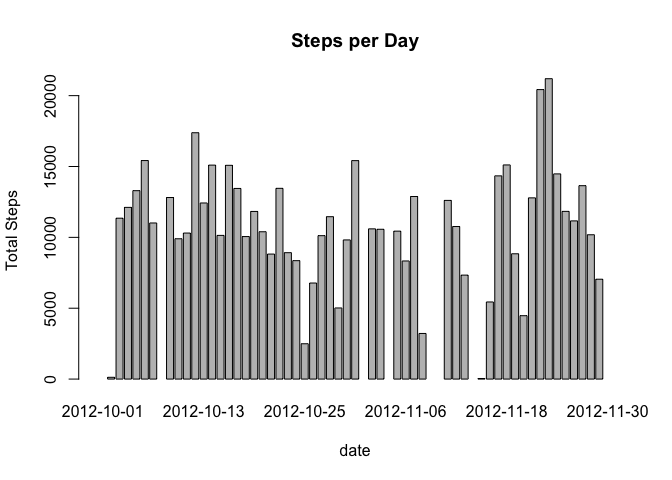
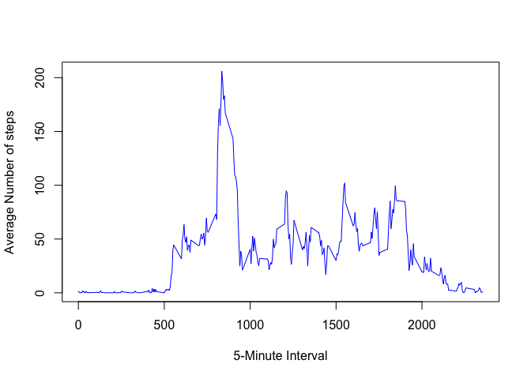
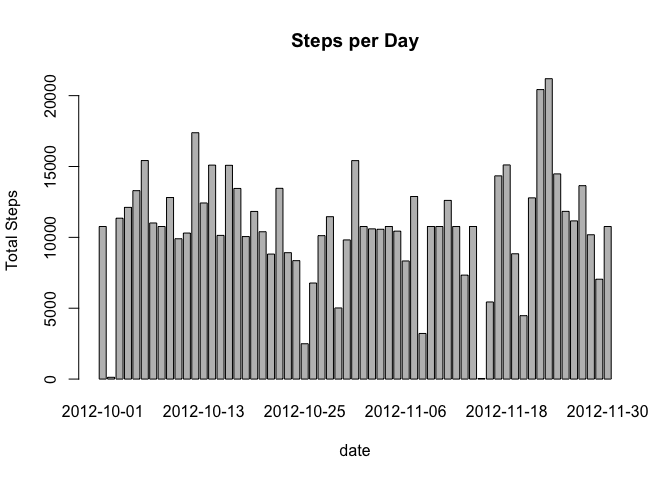
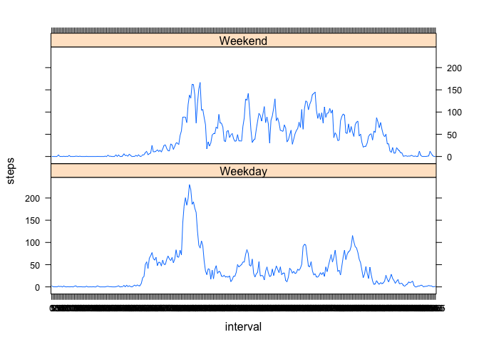

## Reproducible Research: Project Assignment 1  

## Maham Niaz  

### Introduction  
This assignment makes use of data from a personal activity monitoring device. This device collects data at 5 minute intervals throughout the day. The data consists of two months of data from an anonymous individual collected during the months of October and November, 2012 and include the number of steps taken in 5 minute intervals each day.

This document presents the results from Project Assignment 1 in the Coursera course Reproducible Research, written in a single R markdown document that can be processed by knitr and transformed into an HTML file.

### Important Libraries

```r
library(lattice)
```

### Loading and preprocessing the data
Loading/ Reading the data:  

```r
if(!file.exists("activity.csv"))
{
    unzip("activity.zip")
}

data <- read.csv("activity.csv", stringsAsFactors = FALSE)
str(data)
```

```
## 'data.frame':	17568 obs. of  3 variables:
##  $ steps   : int  NA NA NA NA NA NA NA NA NA NA ...
##  $ date    : chr  "2012-10-01" "2012-10-01" "2012-10-01" "2012-10-01" ...
##  $ interval: int  0 5 10 15 20 25 30 35 40 45 ...
```
Processing the data:

```r
data$date <- as.Date(data$date)
data$interval<- as.factor(data$interval)
str(data)
```

```
## 'data.frame':	17568 obs. of  3 variables:
##  $ steps   : int  NA NA NA NA NA NA NA NA NA NA ...
##  $ date    : Date, format: "2012-10-01" "2012-10-01" ...
##  $ interval: Factor w/ 288 levels "0","5","10","15",..: 1 2 3 4 5 6 7 8 9 10 ...
```

### What is mean total number of steps taken per day?
Total number of steps taken per day:  

```r
stepsperday <- tapply(data$steps,data$date, FUN = sum)
head(stepsperday)
```

```
## 2012-10-01 2012-10-02 2012-10-03 2012-10-04 2012-10-05 2012-10-06 
##         NA        126      11352      12116      13294      15420
```
Histogram of total steps per day:  

```r
barplot(stepsperday, xlab = "date", ylab = "Total Steps", main = "Steps per Day")
```

<!-- -->

Mean per day:  

```r
mean(stepsperday, na.rm = TRUE)
```

```
## [1] 10766.19
```

Median per Day:  

```r
median(stepsperday, na.rm = TRUE)
```

```
## [1] 10765
```

### What is the average daily activity pattern?
Average steps per interval:  

```r
stepsperinterval <- tapply(data$steps, data$interval, FUN = mean, na.rm = TRUE)
plot(levels(data$interval),stepsperinterval, type = "l", col="blue", xlab = "5-Minute Interval", ylab = "Average Number of steps" )
```

<!-- -->

5-Minute interval with maximum steps:

```r
max <- which.max(stepsperinterval)
stepsperinterval[max]
```

```
##      835 
## 206.1698
```

### Imputing missing values
Total Number of Missing Values:  

```r
sum(is.na.data.frame(data))
```

```
## [1] 2304
```

New dataset with missing values filled in:  

```r
new_data <- data
new_data[which(is.na(new_data$steps)),1]<- stepsperinterval[new_data[which(is.na(new_data$steps)),3]]
```

Creating a histogram of the new Dataset:    

```r
new_stepsperday <- tapply(new_data$steps,new_data$date, FUN = sum)
barplot(new_stepsperday, xlab = "date", ylab = "Total Steps", main = "Steps per Day")
```

<!-- -->

Caculating new mean    

```r
mean(new_stepsperday)
```

```
## [1] 10766.19
```

Caculating new median  

```r
median(new_stepsperday)
```

```
## [1] 10766.19
```
Caculating mean differnece from the un-inputed dataset:    
 

```r
mean(new_stepsperday)-mean(stepsperday, na.rm = TRUE)
```

```
## [1] 0
```
Caculating median differnece from the un-inputed dataset:    
 

```r
median(new_stepsperday)-median(stepsperday, na.rm = TRUE)
```

```
## [1] 1.188679
```

The median number of steps has changed.  


### Are there differences in activity patterns between weekdays and weekends?
New Factor Variable: Day  
 

```r
new_data$day <- weekdays(new_data$date)
new_data$day <- gsub("Monday", "Weekday", new_data$day)
new_data$day <- gsub("Tuesday", "Weekday", new_data$day)
new_data$day <- gsub("Wednesday", "Weekday", new_data$day)
new_data$day <- gsub("Thursday", "Weekday", new_data$day)
new_data$day <- gsub("Friday", "Weekday", new_data$day)
new_data$day <- gsub("Saturday", "Weekend", new_data$day)
new_data$day <- gsub("Sunday", "Weekend", new_data$day)

new_data$day <- as.factor(new_data$day)
```

Activity plot for Weekdays:

```r
steps.interval <- aggregate(steps ~ interval + day, new_data, mean)
xyplot(steps ~ interval | day, data=steps.interval, layout=c(1,2), type='l')
```

<!-- -->


